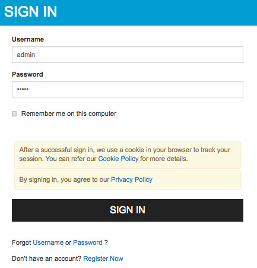
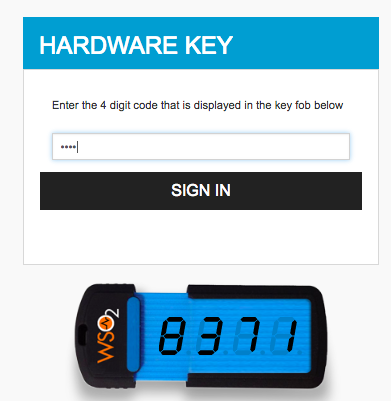

# Configuring OPA Integrator

This topic provides instructions on configuring the OPA Integrator, and the WSO2 Identity Server 
to perform adaptive authentication based on your OPA policies.

### Download OPA
A . To get started downloading an OPA binary for your platform from GitHub releases you can use curl command.
      On macOS (64-bit):
        curl -L -o opa https://openpolicyagent.org/downloads/latest/opa_darwin_amd64
      On Linux (64-bit):
        curl -L -o opa https://openpolicyagent.org/downloads/latest/opa_linux_amd64
      Windows users can obtain the OPA executable from GitHub Releases. The steps below are the same for Windows users except the executable name will be different.

B. Set permissions on the OPA executable:
        chmod 755 ./opa
      
  You can also download and run OPA via Docker. The latest stable image tag is,
      openpolicyagent/opa:latest.
      
      
      
###Run OPA engine.
   After downloading the binary, open the command prompt & start the OPA service by issuing the command:
      ./opa run --server
      (To see more information visit https://www.openpolicyagent.org/docs/latest/#running-opa )
      
   Write an OPA policy and upload to the OPA engine .
      If you have data , first you should upload the data file into OPA using the following curl command : 
      (In this case we don’t have any data so you don’t need to execute this command . But you can use data files as your need.)
            curl -X PUT http://localhost:8181/v1/data/myapi/acl --data-binary @myapi-acl.json
      
   Now you can write down the role base OPA policy as shown below and upload it :
      
   package play.policy
      import input
      default permit = false
      
   Permit {
      role = [“manager” , “admin”]
      user := input.user.roles[_]
      user == role[_]
   }
      
   You can upload the above policy file ispolicy.rego into OPA by using following curl command:
      curl -X PUT http://localhost:8181/v1/policies/myapi --data-binary @ispolicy.rego
      

### Download the OPA Integrator from the store 

   Go to the IS store and download the OPA Integrator

### Deploying JWT SSO artifacts

1. Place the `org.wso2.carbon.identity.application.authz.opa.xxx.jar` file into the `<IS_HOME>/repository/components/dropins`
 directory.

3. [Start/ Restart the WSO2 Identity Server](https://is.docs.wso2.com/en/latest/setup/running-the-product).

### Configuring the service provider

Let's configure the WSO2 Identity Server to use OPA Integrator by
[adding a new Service Provider](https://is.docs.wso2.com/en/latest/learn/adding-and-configuring-a-service-provider).

1. Log in to the
[management console](https://is.docs.wso2.com/en/latest/setup/getting-started-with-the-management-console) as an
administrator.
2. In the **Identity** section under the Main tab, click **Add** under **Service Providers**.
3. Enter a name for the service provider in the **Service Provider Name** text box and click **Register**.
4. Expand the Local and Outbound Configuration section and click Advanced Authentication.
5. Click on Templates on the right side of the Script Based Conditional Authentication field and then add the following script.
      
````

var errorPage = '';
      var errorPageParameters = {
         'status': 'Unauthorized',
         'statusMsg': 'You need to be an admin or a manager'
      };
      var onLoginRequest = function(context) {
         executeStep(1, {
             onSuccess: function (context) {
                invokeOPA('http://localhost:8181/v1/data/play/policy', {"context" :context,"ip_address": "111.222.333.333"},{"sendClaims" : "false", "sendRoles": "true"}, {
                      onSuccess : function(context, data) {
                        var permit = data.result.permit;
                        Log.info('permit '+ permit);
                        Log.info("Successfully posted data.");
                if (permit) {
                      executeStep(2);
                             }else{
                                 Log.debug('User ' + context.currentKnownSubject.identifier + '');
                                 sendError(errorPage, errorPageParameters);
                                }
                             },  onFail : function(context) {
                                  Log.info("Failed to post data");
                                  }
                             });
                      }
              });
        };

````
 
 Using the function “invokeOPA” in adaptive scripts, You can pass any JSON object with the context as the payload, and from OPA it is possible to process the data object and extract the required information.
 Then the OPA engine will execute the defined policies and will send back a JSON response to WSO2 IS. The final authentication or authorization decision will be made by OPA according to the policies that have been defined.
 
 6. Click Ok.

7. The second authentication step that is added is totp. However, totp is an authentication step that you would normally use in production. To try out this scenario, sample authenticators with the sample application, delete the totp authenticator and add the following sample authenticator instead.
      a. Click Delete to remove the totp authenticator from Step 2 (the second authentication step). 
        
      b.Select Demo Hardware Key Authenticator and click Add.
       
      c.  Click Update.
 
 ###Testing the sample scenario


1.Access the following sample PickUp application URL: http://localhost.com:8080/saml2-web-app-pickup-dispatch.com



2. Click Login and enter admin/admin credentials. You are prompted to use the hardware key after basic authentication according to the authentication step defined in the JavaScript above. 
Enter the 4 digit key given on the screen and click Sign In. 
Then you can successfully sign in to the application



3.Next, log out of the application and login again as 'Alex'. Note that this user is not assigned to any role. You will see that this will redirect you to an error page telling “You need to be an admin or a manager.”
